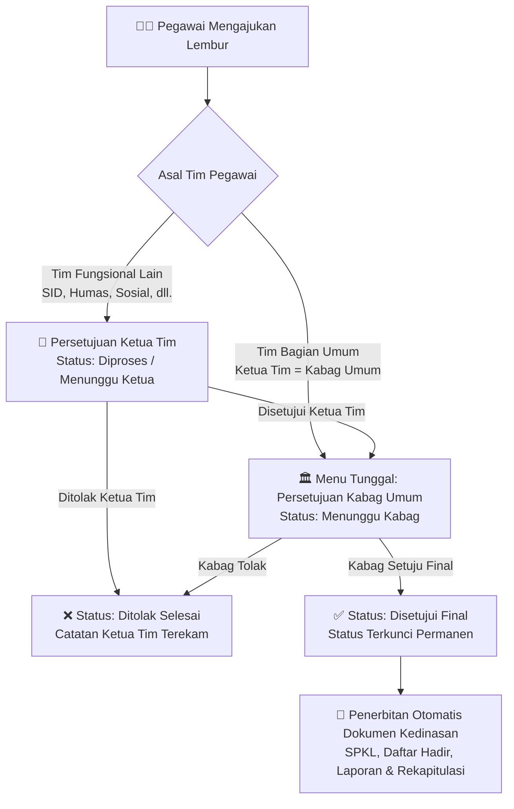

<div align="center">

# 📋 TEMPE DELE
### sisTEM PEngelolaan DokumEn LEmbur Pegawai
**Badan Pusat Statistik (BPS) Provinsi Jawa Tengah**

[](https://laravel.com)
[](https://php.net)
[](https://tailwindcss.com)
[](https://vitejs.dev)
[](https://mysql.com)

</div>

---

## 📖 Tentang Aplikasi

**TEMPE DELE** (*sisTEM PEngelolaan DokumEn LEmbur*) adalah aplikasi web terintegrasi yang dirancang khusus untuk memvalidasi, mengelola, dan mengotomatisasi seluruh siklus administrasi lembur pegawai di lingkungan **Badan Pusat Statistik (BPS) Provinsi Jawa Tengah**.

Sistem ini mentransformasi birokrasi lembur konvensional menjadi ekosistem digital *paperless* yang menghubungkan otentikasi **Single Sign-On (SSO) BPS**, sinkronisasi keanggotaan tim kerja **KIPAPP**, validasi kehadiran presensi riil, pembubuhan tanda tangan elektronik, alur persetujuan bertingkat (*tiered approval*), serta penerbitan otomatis dokumen kedinasan (SPKL, Daftar Hadir, Laporan Pelaksanaan Lembur, dan Rekapitulasi Pembayaran Lembur).

---

## 🔄 Alur Persetujuan Bertingkat (*Tiered Approval Workflow*)

Sistem menerapkan alur verifikasi berjenjang resmi sesuai tata kelola birokrasi BPS Jawa Tengah:



---

## ✨ Fitur-Fitur Unggulan

### 1. 🔐 Integrasi SSO & API Eksternal BPS
- **SSO BPS API Connect**: Autentikasi terpusat seluruh pegawai BPS Jawa Tengah tanpa perlu mengelola kredensial password lokal.
- **SSO Attribute Fetcher**: Penarikan golongan kepangkatan pegawai secara otomatis untuk menentukan besaran tarif uang lembur dan uang makan.
- **KIPAPP Tim Kerja Sync**: Sinkronisasi struktur tim kerja fungsional dan penugasan anggota berkala langsung dari API KIPAPP BPS.

### 2. ⚡ Alur Persetujuan Bertingkat & Penguncian Status (*Status Locking*)
- **Dua Jalur Persetujuan Proporsional**:
  - *Tim Fungsional Lain*: Pegawai $\rightarrow$ Ketua Tim $\rightarrow$ Kepala Bagian Umum $\rightarrow$ Selesai.
  - *Tim Bagian Umum*: Pegawai $\rightarrow$ Langsung ke antrean Kepala Bagian Umum (tanpa duplikasi tahapan).
- **Penguncian Keputusan (*Status Locking*)**: Begitu Kabag Umum menyetujui final atau menolak, status keputusan terkunci permanen untuk menjaga integritas data (hanya jam disetujui atau catatan yang dapat dikoreksi).
- **Catatan Evaluasi Dua Arah**: Kolom `note` (Ketua Tim) dan `note_kabag` (Kabag Umum) dicatat terpisah dan dapat dilihat transparan oleh pegawai.

### 3. ⏱️ Koreksi Otomatis Presensi Riil (`KoreksiLembur`)
- Pengecekan otomatis jam kepulangan aktual pegawai pada mesin presensi harian.
- **Validasi Kepatuhan**: Pengecekan status kehadiran kantor (WFO/WFOL) serta batas jam kedatangan pagi ($\le$ 07:30 WIB).
- **Otomasi Penolakan < 2 Jam**: Jika jam pulang aktual menghasilkan durasi lembur kurang dari 2 jam, sistem otomatis menolak pengajuan dengan catatan sistem.
- **Flag Kelayakan Keuangan (`eligible`)**: Menentukan secara otomatis hak pencairan uang lembur dan uang makan sesuai ketentuan regulasi keuangan negara.

### 4. 📑 Generator Dokumen Resmi & Ekspor Laporan
- **Surat Perintah Kerja Lembur (SPKL)**: PDF otomatis berstandar kedinasan dengan nomor dinas resmi.
- **Daftar Hadir Lembur**: Rekap kehadiran lembur per tim lengkap dengan sematan tanda tangan digital.
- **Laporan Pelaksanaan Lembur**: Uraian kegiatan hasil kerja lembur per penugasan tim.
- **Rekapitulasi Bulanan**: Ekspor rekapitulasi data lembur ke format Excel (`.xlsx`) dan PDF (`.pdf`).

### 5. 🖊️ Digital Signature Pad & Unggah Dokumentasi
- Pembubuhan tanda tangan langsung secara digital pada kanvas layar (*electronic signature*) saat membuat pengajuan.
- Unggah berkas dokumen/foto bukti kegiatan lembur langsung ke penyimpanan server untuk pertanggungjawaban kegiatan.

### 6. 🏛️ Manajemen Pejabat Dinamis (Tanpa Hardcode)
- Pengaturan pejabat struktural (Kepala BPS, Kepala Bagian Umum, PPK) dikelola dinamis melalui database (`m_pejabat`), sehingga pergantian atau mutasi pejabat tidak memerlukan perubahan kode aplikasi.

### 7. 🛡️ Keamanan & Otorisasi Peran (RBAC Middleware)
- Proteksi rute server berlapis menggunakan middleware `CheckRole` untuk mencegah eskalasi wewenang lintas peran (Error 403 Forbidden).
- Rute pengujian otomatis dinonaktifkan di server produksi via pengkondisian environment (`APP_ENV=production`).

---

## 👥 Struktur Role & Hak Akses

| Role | Kode Role | Cakupan Wewenang & Akses Menu |
|:---|:---:|:---|
| **Pegawai** | `user` | Mengajukan lembur mandiri, monitoring progres alur bertingkat, tanda tangan digital, unggah dokumentasi, dan rekap lembur pribadi. |
| **Ketua Tim** | `ketua_tim` | Dashboard tim, memeriksa presensi riil anggota, persetujuan tahap 1 (naik ke Kabag Umum), menolak pengajuan, serta pengajuan lembur mandiri. |
| **Kabag Umum** | `ketua_tim` + Pejabat | Dashboard pemantauan seluruh satker, menu eksklusif **Persetujuan Kabag Umum** untuk memberikan keputusan final seluruh pengajuan lembur BPS. |
| **Pimpinan** | `pimpinan` | Dashboard eksekutif pemantauan makro aktivitas lembur seluruh kantor BPS Provinsi Jawa Tengah (Kepala BPS). |
| **Admin / Superadmin** | `admin` / `superadmin` | Pengelolaan data pegawai, sinkronisasi tim kerja KIPAPP, penetapan pejabat aktif, pengelolaan tarif lembur, operasional presensi, dan generator dokumen resmi. |

---

## 🛠️ Prasyarat Sistem (*Requirements*)

- **PHP**: `>= 8.2`
  - Ekstensi: `pdo_mysql`, `mbstring`, `openssl`, `curl`, `gd`, `zip`, `fileinfo`
- **Web Server**: Apache / Nginx
- **Database**: MySQL `>= 8.0` atau MariaDB `>= 10.4`
- **Dependency Manager**: Composer `>= 2.x`
- **Node.js**: `>= 18.x` & **NPM**: `>= 9.x`

---

## 💻 Panduan Instalasi Lokal (*Local Development Setup*)

### 1. Clone Repositori & Masuk ke Direktori
```bash
git clone https://github.com/muhammadhanief/tempe-dele.git
cd tempe-dele
git checkout update-alur-lembur
```

### 2. Instalasi Dependency Backend & Frontend
```bash
composer install
npm install
```

### 3. Konfigurasi Environment
Salin file konfigurasi contoh:
```bash
cp .env.example .env
```
Sesuaikan konfigurasi database dan API pada `.env`:
```env
APP_NAME="TEMPE DELE"
APP_ENV=local
APP_KEY=
APP_DEBUG=true
APP_URL=http://127.0.0.1:8000

DB_CONNECTION=mysql
DB_HOST=127.0.0.1
DB_PORT=3306
DB_DATABASE=lembur
DB_USERNAME=root
DB_PASSWORD=
```

Generate application key:
```bash
php artisan key:generate
```

### 4. Migrasi Database & Storage Link
Jalankan migrasi tabel aplikasi:
```bash
php artisan migrate
```

Buat symbolic link untuk storage upload berkas & tanda tangan digital:
```bash
php artisan storage:link
```

### 5. Jalankan Server Lokal
Jalankan development server Laravel:
```bash
php artisan serve
```

Pada terminal terpisah, jalankan Vite compiler:
```bash
npm run dev
```

Akses aplikasi melalui browser di: **`http://127.0.0.1:8000`**

> [!TIP]
> **Pengujian Cepat (Auto-Login):**  
> Pada lingkungan lokal (`APP_ENV=local`), Anda dapat memanfaatkan panel **Testing Auto-Login** di halaman login untuk beralih peran (Pegawai, Ketua Tim, Kabag Umum, Admin) secara instan tanpa perlu memasukkan password SSO BPS. Daftar lengkap akun pengujian dapat dilihat di [AKUN_TESTING.md](AKUN_TESTING.md).

---

## 📚 Dokumentasi Pendukung

Informasi teknis dan panduan operasional lebih detail dapat dibaca pada dokumen berikut:

* 📄 **[DOKUMENTASI_PERUBAHAN_ALUR_LEMBUR.md](DOKUMENTASI_PERUBAHAN_ALUR_LEMBUR.md)**: Rincian latar belakang, arsitektur alur bertingkat, daftar kode yang diubah, komparasi panduan awal, dan roadmap UX masa depan.
* 🚀 **[PANDUAN_DEPLOY_SERVER.md](PANDUAN_DEPLOY_SERVER.md)**: Panduan checklist teknis langkah demi langkah untuk proses deploy ke server produksi (cPanel / VPS).
* 🔑 **[AKUN_TESTING.md](AKUN_TESTING.md)**: Daftar akun pengujian lokal dan panduan skenario testing step-by-step.

---

<div align="center">
    <sub>Dikembangkan untuk <b>Badan Pusat Statistik (BPS) Provinsi Jawa Tengah</b></sub>
</div>
